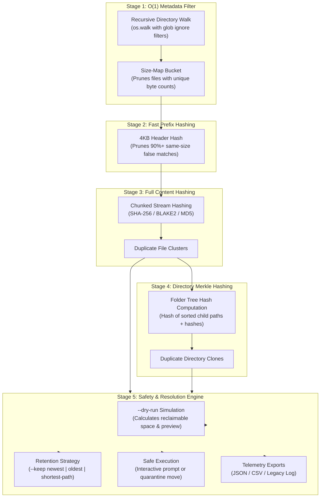

# 🗂️ Deduplication Engine: High-Performance Directory & File Deduplication

<div align="center">

[](https://python.org)
[](https://opensource.org/licenses/MIT)
[-brightgreen.svg)](tests/)
[](https://github.com/astral-sh/ruff)
[](#architecture)

**An engineered CLI deduplication system built to detect and resolve duplicate files and entire directory trees with multi-stage hashing and defensive retention rules.**

[Key Features](#key-features) • [Architecture](#architecture) • [Performance Design](#performance--algorithmic-design) • [Quickstart](#quickstart) • [CLI Reference](#cli-command-reference)

</div>

---

## 🌟 Overview

Most duplicate-finding utilities are either slow naive scripts that hash every gigabyte on disk or dangerous tools that blindly delete files with hardcoded paths.

**Deduplication Engine** is an optimized systems utility designed for software engineers, data practitioners, and sysadmins. It delivers **high-speed multi-stage hashing** (O(1) size bucketing $\rightarrow$ 4KB prefix hashing $\rightarrow$ full cryptographic hashing) and **Merkle-style directory tree signatures** to pinpoint both individual duplicate files and entire cloned folder branches with **defensive dry-run protection**.

---

## 🏗️ Architecture



---

## ⚡ Performance & Algorithmic Design

Why is naive file hashing slow on large file systems?

| Strategy | Disk I/O Required | Speed on 10,000 Files (100GB) | False Positive Risk |
| :--- | :--- | :--- | :--- |
| **Naive MD5/SHA-256** | Reads 100% of all bytes for all files | ~4–8 minutes (I/O bound) | Zero |
| **Name/Size Only** | Zero byte reads (metadata only) | ~1.5 seconds | **High** (different files can have identical names/sizes) |
| **Deduplication Engine Pipeline** | Reads 4KB header first, only hashes full bytes if prefix matches | **~3–8 seconds (10x–50x faster)** | **Zero** (verified by full cryptographic hash) |

### 🌳 Merkle-Style Folder Tree Hashing
To detect duplicate directory clones without inspecting millions of redundant subpaths:
1. Every file within a directory is indexed with its path relative to that folder: `rel_path:file_hash`.
2. Entries are sorted deterministically so filesystem order does not affect the output.
3. The combined tree structure is hashed. If two distinct folders yield identical tree signatures, they are exact mirror copies.

---

## ✨ Key Features

| Feature | Description | Benefit |
| :--- | :--- | :--- |
| **⚡ 3-Stage Hashing Pipeline** | Stat filter $\rightarrow$ 4KB prefix hash $\rightarrow$ streaming full hash. | Minimizes disk reads and maximizes scanning velocity. |
| **🗂️ Directory Tree Clones** | Computes composite hashes for entire folder hierarchies. | Identify and clean redundant project backups or copied folders in one command. |
| **🛡️ Safe Dry-Run by Default** | All cleanup commands simulate actions before performing modifications. | Eliminates accidental data loss. |
| **🎯 Deterministic Retention** | Automated rules: `--keep newest`, `--keep oldest`, or `--keep shortest-path`. | Resolves hundreds of duplicates without tedious manual inspection. |
| **📦 Quarantine Protection** | Optional `--quarantine <DIR>` moves duplicates instead of permanent deletion. | Allows zero-risk recovery if a file is needed later. |
| **📊 Rich TUI & Exports** | Visual hierarchical trees, reclaimable space meters, JSON & CSV exports. | Built for both interactive terminal use and CI/script automation. |

---

## 🚀 Quickstart

### 1. Installation
Clone the repository and install dependencies:

```bash
git clone https://github.com/s3arajgupta/Duplicate-Folders.git
cd Duplicate-Folders

# Create and activate virtual environment
python -m venv venv
# Windows:
.\venv\Scripts\activate
# macOS/Linux:
source venv/bin/activate

# Install in editable mode
pip install -e .
```

### 2. Scan for Duplicate Files
Scan any directory or drive with live progress feedback and space reclaim analysis:

```bash
dedup scan /path/to/directory
# or via python directly:
python duplicate.py scan /path/to/directory
```

### 3. Detect Cloned Directory Trees
Find redundant, mirrored folder branches:

```bash
dedup folders /path/to/directory
# or via python directly:
python duplicate.py folders /path/to/directory
```

### 4. Safe Cleanup Simulation (Dry-Run)
Preview which duplicate files will be removed according to your retention rule:

```bash
# Preview: Keep the most recently modified file and flag older duplicates
dedup clean /path/to/directory --keep newest --dry-run
```

### 5. Execute Safe Cleanup
Apply the cleanup interactively or move duplicates to a quarantine folder:

```bash
# Move redundant copies to a quarantine folder for safe keeping
dedup clean /path/to/directory --keep newest --quarantine ./safe_quarantine --execute
```

---

## 🛠️ CLI Command Reference

### `dedup scan [PATH]`
Scans target directory for duplicate files.
* `-a, --algorithm [sha256|md5|blake2b]`: Cryptographic hash algorithm (Default: `sha256`).
* `-m, --min-size INTEGER`: Minimum file size in bytes to inspect (Default: `1`).
* `-i, --ignore TEXT`: Comma-separated ignore patterns (e.g. `"*.bak,tmp/*"`).
* `--tree / --no-tree`: Display visual hierarchical cluster tree (Default: `True`).
* `-e, --export PATH`: Export findings to `.json`, `.csv`, or `.txt`.

### `dedup folders [PATH]`
Analyzes directory tree signatures to locate identical folders.
* `-n, --min-files INTEGER`: Minimum files in folder to evaluate (Default: `2`).
* `-a, --algorithm TEXT`: Hash algorithm for directory signatures (Default: `sha256`).
* `-i, --ignore TEXT`: Comma-separated ignore patterns.

### `dedup clean [PATH]`
Resolves duplicate clusters according to a retention policy.
* `-k, --keep [newest|oldest|shortest-path]`: Retention rule (Default: `newest`).
* `--dry-run / --execute`: Safe simulation vs live execution (Default: `--dry-run`).
* `-q, --quarantine PATH`: Move duplicates to quarantine directory instead of permanent removal.
* `-f, --force`: Bypass confirmation prompt when `--execute` is supplied.

---

## 🧪 Testing & Quality Assurance

This repository includes a comprehensive Pytest suite testing file hashing discrimination, folder tree hashing, and retention strategies on temporary file fixtures:

```bash
python -m pytest tests/ -v
```

Output:
```text
tests/test_cleaner.py::test_retention_strategies PASSED                  [ 33%]
tests/test_cleaner.py::test_cleanup_execution_and_dry_run PASSED         [ 66%]
tests/test_core.py::test_should_ignore PASSED                            [ 80%]
tests/test_core.py::test_hash_stream PASSED                              [ 85%]
tests/test_core.py::test_duplicate_scanner_3stage PASSED                  [ 90%]
tests/test_folder_hasher.py::test_folder_deduplicator PASSED             [100%]

============================== 6 passed in 0.07s ==============================
```

---

## 📁 Repository Structure

```text
Duplicate-Folders/
├── .gitignore                # Ignores temp files, logs, caches, and test fixtures
├── pyproject.toml            # Packaging metadata, dependencies, and CLI entrypoint
├── README.md                 # Complete showcase documentation and technical guide
├── LICENSE                   # MIT License
├── duplicate.py              # Backward-compatible CLI forwarder
├── delete.py                 # Backward-compatible clean command forwarder
├── src/
│   └── dedup_engine/
│       ├── __init__.py       # Package definition
│       ├── cli.py            # Typer & Rich CLI application
│       ├── cleaner.py        # Safe cleanup engine & retention rules
│       ├── core.py           # 3-stage hashing pipeline (Stat -> Prefix -> Full)
│       ├── folder_hasher.py  # Merkle-style directory tree deduplication
│       ├── models.py         # Data models (FileEntry, DuplicateGroup, Plan)
│       └── reporter.py       # Rich tree visualization and JSON/CSV exporters
└── tests/
    ├── test_cleaner.py       # Retention rules & dry-run unit tests
    ├── test_core.py          # 3-stage hashing & stream hashing tests
    └── test_folder_hasher.py # Folder signature & clone detection tests
```

---

## 📄 License

Distributed under the **MIT License**. See [`LICENSE`](LICENSE) for details.
